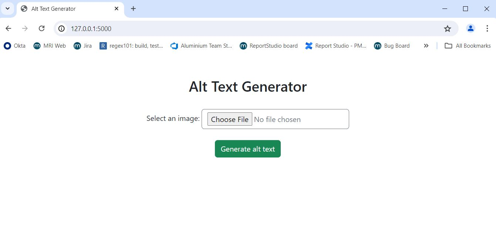
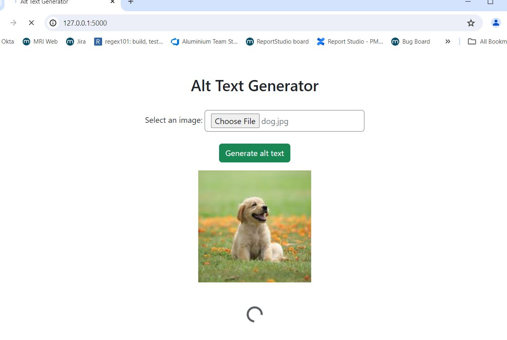
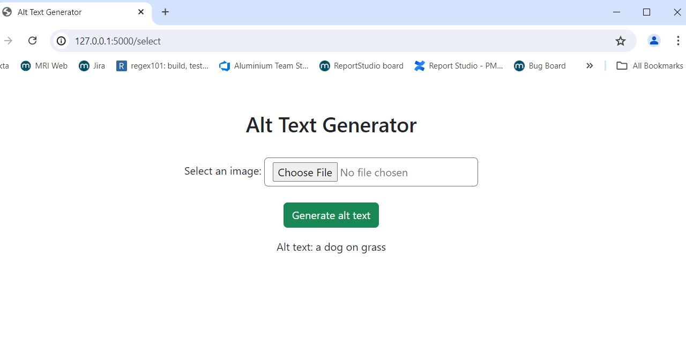
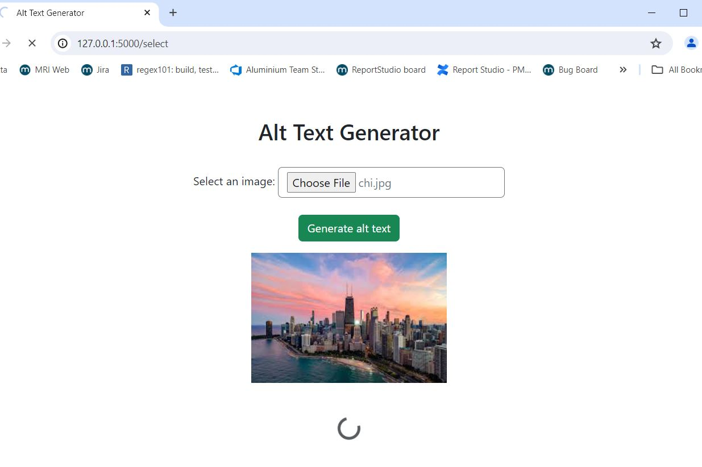
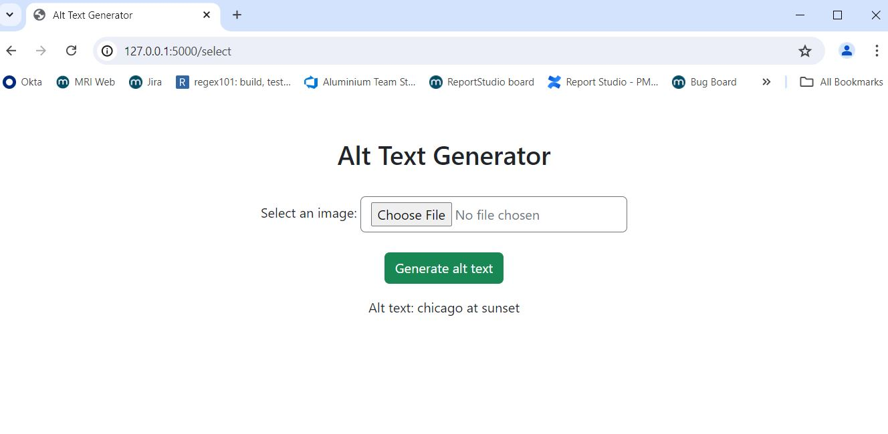

## Alternative Text Generator 
- generates alternative text given an image using the blib (bootstrapping language-image pre-training) libary. 
to run: python camption.py 

### Example: 

### Second example:

### notes:
Need to have the blib library (https://huggingface.co/docs/transformers/en/model_doc/blip) 

package dependencies: 
python -m pip install 
keras
tensorflow
pillow 
scipy
